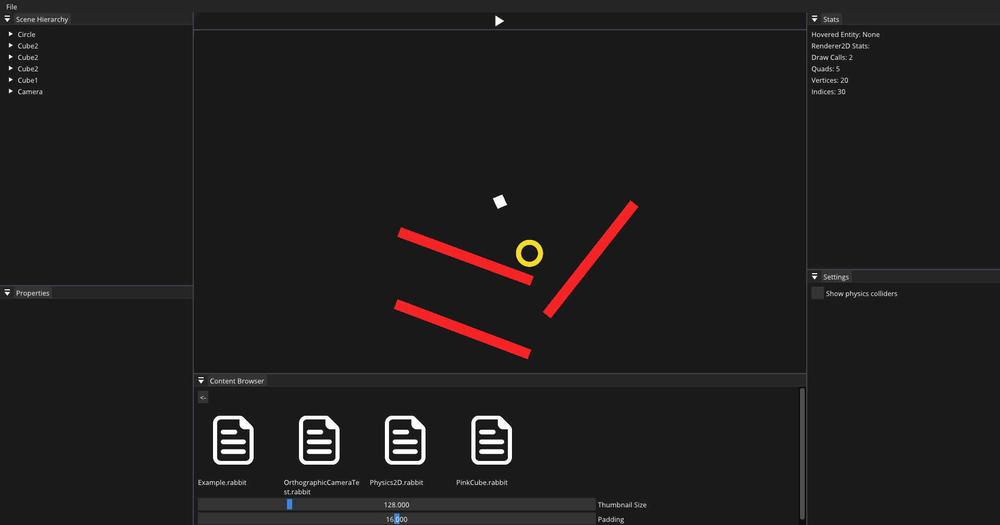

# RabbitEngine
Design custom game engine

## How to build

1. Download **premake5** （https://github.com/premake/premake-core/releases），put it into **RabbitEngine\vendor\premake\bin**
2. Download **vulkan sdk** （https://vulkan.lunarg.com/sdk/home#windows）, chooese **Debuggable Shader API Libraries-64-bit** option when installing
3. Run RabbitEngine\scripts\Setup.bat

## Screenshots

​	
